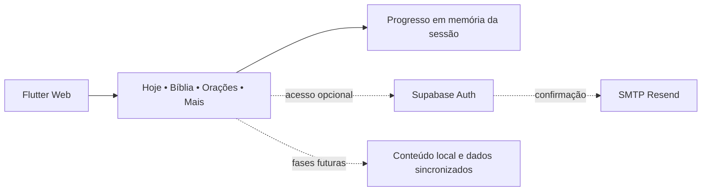

# Vida com Cristo

Aplicação web desenvolvida em Flutter para uma plataforma cristã digital,
atualmente em MVP, com autenticação e uma base preparada para expansão de
conteúdos e experiências de fé.

## Status

O MVP abre diretamente em **Hoje**, sem exigir login. Ele apresenta saudação,
data, progresso semanal em memória, conteúdo editorial provisório claramente
identificado e uma ação de conclusão diária. Bíblia e Orações têm telas
informativas; os recursos completos ainda não estão disponíveis.

Cadastro, login e logout continuam disponíveis em **Mais** quando o Supabase
está configurado. O Auth é opcional para abrir o conteúdo público e os fluxos
são cobertos por testes com respostas HTTP simuladas.

O progresso desta fase dura somente a sessão atual. Não há sincronização, CRUD
de orações, texto bíblico completo ou comunidade.
Áudio, notificações e funcionamento offline não estão implementados.

Domínio planejado: **soufeeacao.com.br**. O domínio não indica um deploy concluído.

## Funcionalidades implementadas

- Acesso guest-first à Home **Hoje**, sem login obrigatório.
- Navegação responsiva entre Hoje, Bíblia, Orações e Mais.
- Saudação, data, progresso gentil de `X de 7 dias` e conclusão idempotente da rotina.
- Cards de devocional e versículo provisórios, sem apresentar conteúdo não revisado como publicação.
- Tema claro e escuro para a sessão, com Inter na interface e Merriweather no conteúdo editorial.
- Cadastro por e-mail e senha, com confirmação de senha na interface.
- Validação de e-mail e senha: mínimo de seis caracteres, letra minúscula e número.
- Aviso de confirmação por e-mail quando o Supabase não retorna uma sessão.
- Login e logout com Supabase Auth.
- Acesso à conta opcional em Mais; observação de mudanças de sessão.
- Feedback de carregamento e falhas sem exibir detalhes internos do backend.
- Formulário com largura limitada e home rolável para telas pequenas e grandes.
- Configuração de build por `--dart-define`, com mensagem clara se estiver ausente.

Não há tabelas próprias, storage, backend Node ou funções server-side. A Bíblia
e as Orações ainda são placeholders profissionais, sem dados reais persistidos.

## Arquitetura



`lib/screens` contém as telas; `lib/providers/auth_provider.dart` coordena
autenticação e estado; `lib/config/supabase_config.dart` valida a configuração.
O SDK Supabase gerencia a sessão no navegador. O aplicativo não consulta
`auth.users` diretamente nem acessa tabelas do schema público.

## Stack e reprodução

- Flutter **3.47.2**; Dart **3.13.2**.
- Provider **6.1.5+1**.
- Supabase Flutter **1.10.25**.
- Dependências resolvidas em `pubspec.lock`, versionado por ser uma aplicação.

Use a versão Flutter indicada em `.flutter-version` e no
[arquivo oficial de versões](https://docs.flutter.dev/install/archive).
O arquivo registra a versão, mas não instala nem seleciona o SDK automaticamente.

As faixas de dependências existentes foram preservadas; bibliotecas de recursos
futuros ainda podem constar no manifest e não representam recursos implementados.
Não é necessário executar `flutter pub upgrade`.

```bash
flutter --version
flutter pub get --enforce-lockfile
flutter analyze
flutter test
```

## Configuração e execução local

Configure no ambiente local somente os nomes:

- `SUPABASE_URL`: URL HTTPS do projeto Supabase.
- `SUPABASE_ANON_KEY`: chave pública **anon JWT** do projeto.

Esta versão preserva o SDK Supabase 1.x e utiliza sua chave anon JWT.
Nunca use `service_role` nem uma chave `sb_secret_...` no frontend.

Com as variáveis disponíveis no shell:

```bash
flutter run -d chrome --web-port 3000 \
  --dart-define=SUPABASE_URL="$SUPABASE_URL" \
  --dart-define=SUPABASE_ANON_KEY="$SUPABASE_ANON_KEY"
```

Sem configuração, o aplicativo apresenta uma tela explicativa e não inicializa
o cliente Supabase. Valores fictícios servem para compilação, não para login.
Arquivos `.env*` estão ignorados e não são carregados automaticamente pelo Flutter.

## Preparar Supabase antes da produção

1. Selecionar um projeto Supabase e habilitar autenticação por e-mail e senha.
2. Manter confirmação por e-mail habilitada e revisar os requisitos de senha
   no provedor para que não sejam mais fracos que os do formulário.
3. Configurar **Site URL** como `https://soufeeacao.com.br` antes da produção.
   Durante homologação, usar a origem exata do ambiente que será testado.
4. Revisar a allow-list de redirects para as origens efetivamente utilizadas,
   incluindo o ambiente local quando necessário. O cadastro usa o Site URL
   padrão do Supabase para o link de confirmação.
5. Preparar entrega de e-mail de produção no próprio Supabase Auth.
   O SMTP padrão é restrito e não atende cadastro público de usuários arbitrários.
   Nenhum provedor de e-mail foi contratado ou configurado nesta fase.
6. Testar com conta controlada: cadastro, confirmação, login, recarga de página,
   logout e tentativa de acesso após logout.

O MVP utiliza **somente Auth** e o conteúdo público não depende de login. Não é
necessário criar tabelas, migrations, buckets ou políticas RLS de conteúdo agora.
Tabelas futuras deverão ter RLS e políticas por usuário antes de serem acessadas
pelo navegador.

Referências oficiais:
[URLs de autenticação](https://supabase.com/docs/guides/auth/redirect-urls) e
[entrega de e-mail](https://supabase.com/docs/guides/auth/auth-smtp).

## Segurança

As variáveis de build da aplicação web ficam incorporadas ao bundle.
A chave anon é pública por projeto; a proteção dos dados depende do Supabase Auth
e, quando houver tabelas próprias, de RLS. A validação local da chave evita erros
de configuração, mas não substitui a validação criptográfica feita pelo servidor.

O código bloqueia configuração com papel diferente de anon e nunca imprime os
valores de configuração ou as respostas internas de erro.
Sessões são gerenciadas pelo SDK; não há senhas persistidas pelo código da aplicação.
Não versione credenciais, arquivos de ambiente ou artefatos de build.

## Build de produção

```bash
flutter build web --release \
  --dart-define=SUPABASE_URL="$SUPABASE_URL" \
  --dart-define=SUPABASE_ANON_KEY="$SUPABASE_ANON_KEY"
```

Saída: **`build/web`**. O diretório é gerado pelo Flutter e ignorado pelo Git.
O HTML contém o bootstrap Flutter, não uma demonstração manual separada.

O build JavaScript é o alvo validado. Dependências legadas ainda geram avisos
na checagem opcional de WebAssembly; não foi feita migração para Wasm nesta fase.

O build de verificação desta preparação usa valores sintéticos. Gere novamente
com a configuração do projeto real antes de enviar os arquivos à hospedagem.

## Deploy planejado: Cloudflare Pages

O aplicativo é uma SPA estática; não precisa de Workers, servidor Node ou Docker.
O caminho inicial planejado é **Direct Upload** do conteúdo de `build/web`,
depois de validar o build e a configuração real.

O projeto Pages e seu domínio personalizado serão configurados em uma fase
autorizada separadamente. Não basta configurar variáveis no painel após o build:
elas precisam ser passadas ao compilador Flutter.

Direct Upload não pode ser convertido em integração Git no mesmo projeto.
Uma eventual automação futura deverá considerar essa escolha.
[Documentação oficial do Pages](https://developers.cloudflare.com/pages/get-started/direct-upload/).

## Testes e limites

A suíte cobre validações, configuração ausente ou inválida, rejeição de chaves
privilegiadas, cadastro com e sem sessão, login, logout, falhas HTTP, envio duplicado,
navegação guest-first, progresso idempotente e telas em dimensões mobile e desktop.

Os testes não usam contas reais nem enviam e-mails. Aprovação desses testes e do
build não comprova a configuração externa de produção.
Recuperação de senha, exclusão de conta e conteúdos de fé ficam fora deste MVP.

## Roadmap

- Homologar Supabase Auth, e-mail e sessão no navegador.
- Publicar o MVP no domínio planejado após autorização.
- Implementar o Reader Mode local com tradução licenciada.
- Implementar orações privadas com persistência local segura.
- Avaliar sincronização opcional com RLS e consentimento.
- Avaliar recuperação de senha e gestão de conta na próxima etapa.

Não há screenshots de uma implantação real disponíveis nesta preparação.

## Autoria e GitHub

Desenvolvido por [Andrearodri](https://github.com/Andrearodri), com apoio de
ferramentas de IA no desenvolvimento e revisão.

Descrição sugerida para a fase atual:

> Flutter Web MVP for a Christian digital platform with Supabase authentication, prepared for Cloudflare Pages.

Após o deploy, a descrição pode usar:

> Flutter Web app for a Christian digital platform, built with Dart, Supabase authentication and Cloudflare Pages.

Topics sugeridos: `flutter`, `dart`, `supabase`, `cloudflare-pages`,
`authentication`, `web-app`.

A visibilidade e os metadados remotos não foram alterados. Uma licença do projeto
ainda precisa ser escolhida pelo autor; as dependências mantêm suas licenças.
