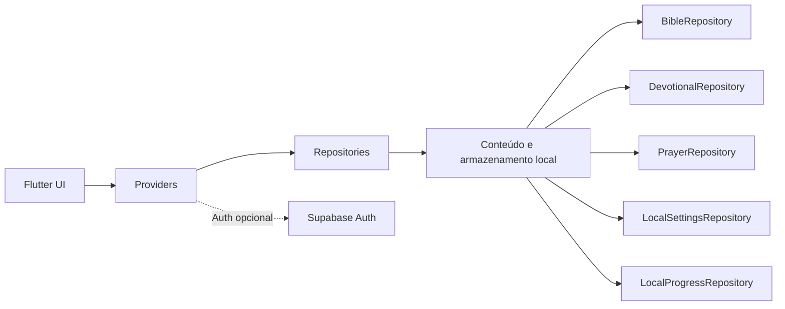

# Sou Fé e Ação

Aplicação cristã local-first construída em Flutter para leitura bíblica piloto,
devocionais, orações privadas e uma rotina diária acolhedora. O MVP é
guest-first: o conteúdo principal abre sem conta, enquanto o Supabase Auth é
opcional para quem desejar entrar.

## Demo

<https://soufeeacao.com.br>

## Principais recursos

- Experiência guest-first, sem login obrigatório para começar.
- Tela **Hoje** com saudação, rotina diária e progresso semanal sem streak
  punitivo.
- Bíblia piloto local-first com João 1–3, Salmos 1–5 e Provérbios 1–3.
- Texto bíblico da Bíblia Livre (BLIVRE), com atribuição no leitor.
- Sete devocionais iniciais revisados e aprovados por revisão humana.
- Diário de pedidos de oração privado, com criação, edição, resposta e remoção.
- Preferências locais para nome, tema claro/escuro e tamanho de fonte.
- Supabase Auth opcional para cadastro, confirmação por e-mail, login e logout.
- Interface Flutter responsiva para Web e mobile.

## Conteúdo bíblico

O piloto incorpora trechos da **Bíblia Livre (BLIVRE)** sob a licença
[CC BY 3.0 Brasil](https://creativecommons.org/licenses/by/3.0/br/). A fonte,
a autoria e a versão de origem estão registradas em
[THIRD_PARTY_NOTICES.md](THIRD_PARTY_NOTICES.md). O repositório não inclui uma
Bíblia completa.

## Devocionais

Os sete devocionais iniciais são conteúdo local com status editorial
`approved`, após revisão humana. O aplicativo não usa IA em runtime e não
publica conteúdo espiritual automaticamente.

## Arquitetura



O conteúdo bíblico piloto e os devocionais ficam no aplicativo. `shared_preferences`
persiste apenas dados não sensíveis — nome local, aparência, tamanho de fonte e
progresso. `flutter_secure_storage` é usado exclusivamente para as orações.
No estado atual, o Supabase é utilizado somente pelo Auth; não há tabelas,
Storage, Edge Functions ou sincronização de orações.

## Stack

- Flutter 3.47.2 e Dart 3.13.2.
- Provider 6.1.5+1.
- Supabase Flutter 1.10.25 para Auth opcional.
- `shared_preferences` 2.5.5 para preferências não sensíveis.
- `flutter_secure_storage` 10.3.3 para orações locais.
- Cloudflare Pages para a hospedagem Web.

As versões resolvidas estão fixadas em `pubspec.lock`, que permanece
versionado.

## Execução local

Instale o Flutter 3.47.2 e execute:

```bash
flutter pub get
flutter run -d chrome
```

Esse fluxo abre a experiência guest. Para disponibilizar o Auth localmente,
forneça somente a URL do projeto e sua chave pública anon na compilação:

```bash
flutter run -d chrome \
  --dart-define=SUPABASE_URL=https://<project-ref>.supabase.co \
  --dart-define=SUPABASE_ANON_KEY=<public-anon-jwt>
```

Use [`.env.example`](.env.example) apenas como referência de nomes. Flutter
não carrega esse arquivo automaticamente; não grave valores reais nele nem no
Git. Sem essas definições, Auth fica indisponível, mas a experiência guest
continua funcionando.

## Segurança e privacidade

- O texto das orações não é enviado ao Supabase, a serviços de IA ou a
  analytics pelo aplicativo.
- As orações usam `flutter_secure_storage`; no Web, isso depende das garantias
  do navegador, WebCrypto e HTTPS. O pacote requer HTTPS ou `localhost` nessa
  plataforma.
- Armazenamento local não protege contra um navegador, extensão ou dispositivo
  comprometido, e não constitui promessa de criptografia absoluta.
- A chave `SUPABASE_ANON_KEY` é client-side e vai para o bundle Web. Nunca use
  `service_role`, `sb_secret_...`, senha SMTP ou qualquer outra credencial
  privilegiada no frontend.
- Nenhum segredo é versionado; use definições de compilação para a configuração
  de Auth.

## Build de produção

```bash
flutter build web --release \
  --dart-define=SUPABASE_URL=https://<project-ref>.supabase.co \
  --dart-define=SUPABASE_ANON_KEY=<public-anon-jwt>
```

A saída é `build/web` e não deve ser versionada. O aplicativo é uma SPA estática
hospedada no Cloudflare Pages; não requer Worker, servidor Node ou Docker.

## Testes e qualidade

```bash
flutter analyze
flutter test
flutter build web --release
```

Atualmente, a suíte possui 41 testes. Ela cobre Auth com fixtures sintéticas,
configuração de Supabase, modo guest, persistência local, navegação, Bíblia
piloto, devocionais, orações e progresso diário idempotente. O workflow de CI
executa os mesmos checks sem credenciais de produção.

## Estado do projeto

**MVP em produção / vertical slice validada.** A jornada atual cobre
**Hoje → Bíblia → Devocional → Oração → concluir dia**, com Auth opcional.
O produto não se apresenta como uma plataforma completa.

### Limitações atuais

- A Bíblia é um piloto e não contém os 66 livros.
- Há somente uma tradução no piloto.
- Não existe sincronização de orações entre dispositivos.
- Não há comunidade, feed social, chat, áudio, IA em runtime ou monetização.
- O armazenamento no Web tem limites inerentes ao navegador e ao dispositivo.

## Licença

O código e o conteúdo autoral do Sou Fé e Ação permanecem com todos os direitos
reservados. A publicação no GitHub tem finalidade de portfólio, avaliação e
demonstração; ela não concede reutilização irrestrita. Consulte
[LICENSE](LICENSE) para a nota completa.

Componentes e conteúdos de terceiros permanecem sob suas respectivas licenças.
O texto bíblico BLIVRE não está coberto pela reserva autoral deste projeto e
continua sujeito à CC BY 3.0 Brasil, conforme [THIRD_PARTY_NOTICES.md](THIRD_PARTY_NOTICES.md).

## Autoria

Desenvolvido por [Andrearodri](https://github.com/Andrearodri). Ferramentas de
IA foram usadas como apoio ao desenvolvimento e à revisão; a publicação de
conteúdo espiritual exige revisão humana.
